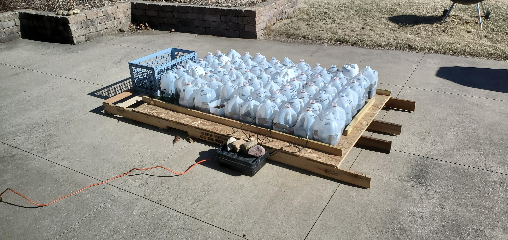

# Milk Jug Greenhouse Sensors

This project collects soil temperature, air temperature, and humidity readings from milk jug greenhouses.

It runs on a RPi Zero W 2+ with 4x DS18B20 temperature sensors and 2x SHT-30 temperature/humidity sensors.

